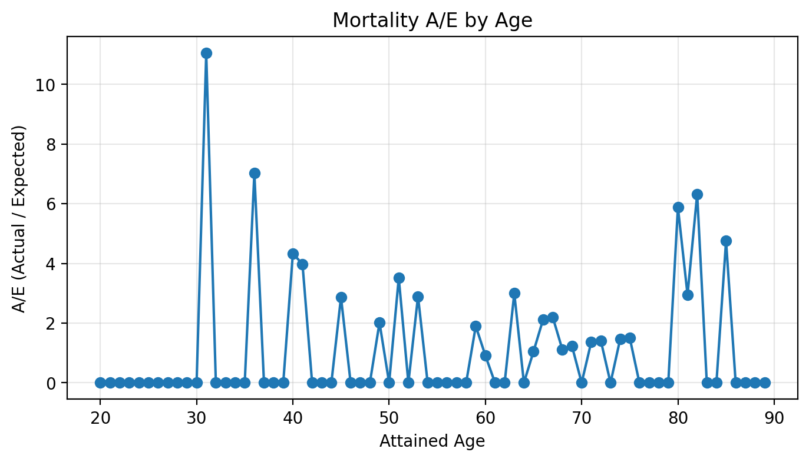

Life Insurance Experience Study & Pricing

See notebooks and src.

# Life Insurance Experience Study & Pricing

This project explores a simplified actuarial workflow using synthetic life insurance data:

- Data ingestion
- Experience study
- Pricing and reserves
- Sensitivity analysis

## Mortality Experience Study

Below is the Actual/Expected (A/E) mortality ratio by attained age from our synthetic life insurance dataset:

_Interpretation_: An A/E near 1.0 suggests mortality experience aligns with expected. Ratios >1.0 indicate higher actual deaths than expected, while <1.0 suggests lower mortality.

*Interpretation*: This plot compares actual deaths in the simulated portfolio against expected deaths from a standard mortality table.  
An A/E ratio near 1.0 means experience aligns with assumptions, while values above 1.0 indicate higher mortality and values below 1.0 indicate lower mortality.  
This type of **experience study** is a core actuarial task, helping insurers validate pricing and adjust assumptions.
